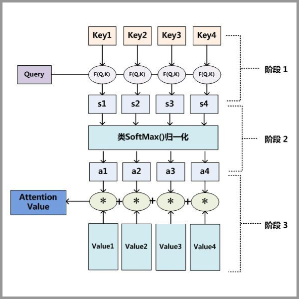

#  Graph Attention Networks 核心思想与原理

 
2021年01月07日

## 预备知识

- 简单图论

- 简单GNN

- 简单GCN

- 简单Attention

- GAT核心思想与原理

 

## 简单图论

 

#### 定义一（图） ：

- 一个图被记为$\mathcal{G}=\{\mathcal{V}, \mathcal{E}\}$，其中 $\mathcal{V}=\left\{v_{1}, \ldots, v_{N}\right\}$是数量为$N=|\mathcal{V}|$ 的节点的集合， $\mathcal{E}=\left\{e_{1}, \ldots, e_{M}\right\}$ 是数量为 $M$ 的边的集合。
- 图用节点表示实体（entities），用边表示实体间的关系（relations）。
- 在图的计算任务中，我们认为，节点一定含有信息（至少含有节点的度的信息），边可能含有信息。

####  定义二（图的邻接矩阵） ：

- 给定一个图$\mathcal{G}=\{\mathcal{V}, \mathcal{E}\}$，其对应的**邻接矩阵**被记为$\mathbf{A} \in\{0,1\}^{N \times N}$。$\mathbf{A}_{i, j}=1$表示存在从节点$v_i$到$v_j$的边，反之表示不存在从节点$v_i$到$v_j$的边。

- 在**无向图**中，从节点$v_i$到$v_j$的边存在，意味着从节点$v_j$到$v_i$的边也存在。因而**无向图的邻接矩阵是对称的**。

- 在**无权图**中，**各条边的权重被认为是等价的**，即认为**各条边的权重为$1$**。

- 对于**有权图**，其对应的邻接矩阵通常被记为$\mathbf{W} \in \mathbb{R}^{N \times N}$，其中$\mathbf{W}_{i, j}=w_{ij}$表示从节点$v_i$到$v_j$的边的权重。若边不存在时，边的权重为$0$。

 

#### 定义三（节点的度，degree）：

- 对于有向有权图，节点$v_i$的出度（out degree）等于从$v_i$出发的边的权重之和，节点$v_i$的入度（in degree）等于从连向$v_i$的边的权重之和。
- 无向图是有向图的特殊情况，节点的出度与入度相等。
- 无权图是有权图的特殊情况，各边的权重为$1$，那么节点$v_i$的出度（out degree）等于从$v_i$出发的边的数量，节点$v_i$的入度（in degree）等于从连向$v_i$的边的数量。
- 节点$v_i$的度记为$d(v_i)$，入度记为$d_{in}(v_i)$，出度记为$d_{out}(v_i)$。

#### 定义四（邻接节点，neighbors）：

- **节点$v_i$的邻接节点为与节点$v_i$直接相连的节点**，其被记为$\mathcal{N(v_i)}$。
- **节点$v_i$的$k$跳远的邻接节点**  （neighbors with $k$-hop）指的是到节点$v_i$要走$k$步的节点（一个节点的$2$跳远的邻接节点包含了自身）。

#### 定义五（度数矩阵,Degree matrix）：

- 给定一个图 ${\displaystyle G=(V,E)}G=(V,E)$ 与 ${\displaystyle |V|=n}{\displaystyle |V|=n}$， ${\displaystyle G}$的度数矩阵 ${\displaystyle D}$是一个 ${\displaystyle n\times n}n\times n$的对角线矩阵，其定义为

$${\displaystyle d_{i,j}:=\left\{{\begin{matrix}\deg(v_{i})&{{if}}\ i=j\\0&{{otherwise}}\end{matrix}}\right.}$$
#### 定义六（拉普拉斯矩阵，Laplacian Matrix）：

- 给定一个图$\mathcal{G}=\{\mathcal{V}, \mathcal{E}\}$，其邻接矩阵为$A$，其拉普拉斯矩阵定义为$\mathbf{L=D-A}$，其中$\mathbf{D=diag(d(v_1), \cdots, d(v_N))}$。
  

#### 定义七（对称归一化的拉普拉斯矩阵，Symmetric normalized Laplacian）：

- 给定一个图$\mathcal{G}=\{\mathcal{V}, \mathcal{E}\}$，其邻接矩阵为$A$，其规范化的拉普拉斯矩阵定义为

$$
\mathbf{L=D^{-\frac{1}{2}}(D-A)D^{-\frac{1}{2}}=I-D^{-\frac{1}{2}}AD^{-\frac{1}{2}}}
$$

#### 例子:

 

## 简单GNN

 

## GNN流程

-  聚合

-  更新

-  循环

 

### 聚合

**经过一次聚合后:**
A的邻居信息 $N_A=b(2,2,2,2,2)+c(3,3,3,3,3)+d(4,4,4,4,4)$
$b,c,d$分别为B,C,D对A的权重

 

### 更新

A的邻居信息 $N_{A}^{0}=b(2,2,2,2,2)+c(3,3,3,3,3)+d(4,4,4,4,4)$
A的信息 $x_{A}^{1}=\sigma(W_0((1,1,1,1,1)+\alpha*N_{A}^{0}))$
$\sigma$是激活函数($relu,sigmoid$.etc)
$W$是模型需要训练的参数

 

### 循环

多次以后: A的信息 $x_{A}^{t+1}=\sigma(W_t(x_{A}^{t}+\alpha*N_{A}^{t}))$
简写为$H^{(k+1)}=f\left(H^{(k)}, A\right)
$

 

用$\mathbf{x}^{(k-1)}_i\in\mathbb{R}^F$表示$(k-1)$层中节点$i$的节点表征，$\mathbf{e}_{j,i} \in \mathbb{R}^D$ 表示从节点$j$到节点$i$的边的属性，图神经网络可以描述为:
$$
\mathbf{x}_i^{(k)} = \gamma^{(k)} \left( \mathbf{x}_i^{(k-1)}, \square_{j \in \mathcal{N}(i)} \, \phi^{(k)}\left(\mathbf{x}_i^{(k-1)}, \mathbf{x}_j^{(k-1)},\mathbf{e}_{j,i}\right) \right),
$$
其中$\square$表示可微分的、具有排列不变性（函数输出结果与输入参数的排列无关）的函数。具有排列不变性的函数有，`sum()`函数、`mean()`函数和`max()`函数。$\gamma$和$\phi$表示可微分的函数，如MLPs（多层感知器）。

 

## 简单GCN

**[`GCNConv`](https://pytorch-geometric.readthedocs.io/en/latest/modules/nn.html#torch_geometric.nn.conv.GCNConv)的数学定义为**
$$
\mathbf{x}_i^{(k)} = \sum_{j \in \mathcal{N}(i) \cup \{ i \}} \frac{1}{\sqrt{\deg(i)} \cdot \sqrt{\deg(j)}} \cdot \left( \mathbf{W} \cdot \mathbf{x}_j^{(k-1)} \right),
$$
其中，邻接节点的表征$\mathbf{x}_j^{(k-1)}$首先通过与权重矩阵$\mathbf{W}$相乘进行变换，然后按端点的度$\deg(i), \deg(j)$进行归一化处理，最后进行求和。这个公式可以分为以下几个步骤：

1. 向邻接矩阵添加自环边。
1. 对节点表征做线性转换。
1. 计算归一化系数。
1. 归一化邻接节点的节点表征。
1. 将相邻节点表征相加（"求和 "聚合）。

**深度学习**中最重要的是学习特征：随着网络层数的增加，特征越来越抽象，然后用于最终的任务。对于图任务来说，这点同样适用，我们希望深度模型从图的最初始特征$X$出发学习到更抽象的特征，比如学习到了某个节点的高级特征，这个特征根据图结构融合了图中其他节点的特征，我们就可以用这个特征用于节点分类或者属性预测。那么图网络就是要学习新特征，用公式表达就是：
$$
H^{(l+1)}=\sigma\left(\tilde{D}^{-\frac{1}{2}} \tilde{A} \tilde{D}^{-\frac{1}{2}} H^{(l)} W^{(l)}\right)
$$
这里k指的是网络层数，$H^{k}$就是网络第k层的特征，其中$H^{(0)}=X$。

那么**现在的问题**是如何学习，我们可以从CNN中得到启发：

这是一个简单的3x3卷积层，每个新特征的学习是这样的：对其领域（3x3局部空间）的特征进行变换$（w_i,w_j）$，然后求和$(\sum_{i}w_ix_i)$。类比到图学习上，每个节点的新特征可以类似得到：对该节点的邻域节点特征进行变换，然后求和。用公式表达就是：

$$H^{(k+1)}=f\left(H^{(k)}, A\right)=\sigma\left(A H^{(k)} W^{(k)}\right)$$
这里的$W^k$是学习权重，维度为$F^{k-1} \times F^{k}$，而$\sigma(\cdot)$是激活函数，比如是ReLU，这是神经网路的基本单元。

### 图卷积
上述的加法规则只是一个简单实现，其存在两个问题：**第一个问题**是在计算新特征时没有考虑自己的特征，这肯定是个重大缺陷；**第二个问题是**采用加法规则时，度大的节点特征越来越大，而对于度小的节点却相反，这可能导致网络训练过程中梯度爆炸或者消失的问题。

针对第一个问题，我们可以给图中每个节点增加自连接，实现上可以直接改变邻接矩阵：
$$
\tilde{A}=A+I_{N}
$$
针对第二个问题，我们可以对邻接矩阵进行归一化，使得$A$的每行和值为1，在实现上我们可以乘以度矩阵的逆矩阵：$\tilde{D}^{-1} \tilde{A}$，这里的度矩阵是更新$A$后重新计算的。这样我们就得到：
$$
H^{(k+1)}=f\left(H^{(k)}, A\right)=\sigma\left(\tilde{D}^{-1} \tilde{A} H^{(k)} W^{(k)}\right)
$$

相比加法规则，这种聚合方式其实是对领域节点特征求平均，这里：
$$
\begin{aligned}
\left(\tilde{D}^{-1} \tilde{A} H\right)_{i} &=\left(\tilde{D}^{-1} \tilde{A}\right)_{i} H \\
&=\left(\sum_{k} \tilde{D}_{i k}^{-1} \tilde{A}_{i}\right) H \\
&=\left(\tilde{D}_{i i}^{-1} \tilde{A}_{i}\right) H \\
&=\tilde{D}_{i i}^{-1} \sum_{j} \tilde{A}_{i j} H_{j} \\
&=\sum_{j} \frac{1}{\tilde{D}_{i i}} \tilde{A}_{i j} H_{j}
\end{aligned}
$$
由于$\tilde{D}=\sum_{j} \tilde{A}_{i j}$，所以这种聚合方式其实就是求平均，对领域节点的特征是求平均值，这样就进行了归一化，避免求和方式所造成的问题。

更进一步地，我们可以采用对称归一化来进行聚合操作，这就是论文1中所提出的图卷积方法：
$$
H^{(k+1)}=f\left(H^{(k)}, A\right)=\sigma\left(\tilde{D}^{-0.5} \tilde{A} \tilde{D}^{-0.5} H^{(k)} W^{(k)}\right)
$$

这种新的聚合方法不再是单单地对邻域节点特征进行平均，这里：
$$
\begin{aligned}
\left(\tilde{D}^{0.5} \tilde{A} \tilde{D}^{0.5} H\right)_{i} &=\left(\tilde{D}^{0.5} \tilde{A}\right)_{i} \tilde{D}^{0.5} H \\
&=\left(\sum_{k} \tilde{D}_{i k}^{0.5} \tilde{A}_{i}\right) \tilde{D}^{0.5} H \\
&=\tilde{D}_{i i}^{0.5} \sum_{j} \tilde{A}_{i j} \sum_{k} \tilde{D}_{j k}^{0.5} H_{j} \\
&=\tilde{D}_{i i}^{-0.5} \sum_{j} \tilde{A}_{i j} \tilde{D}_{j j}^{-0.5} H_{j} \\
&=\sum_{j} \frac{1}{\sqrt{\tilde{D}_{i i} \tilde{D}_{j j}}} \tilde{A}_{i j} H_{j}
\end{aligned}
$$
可以看到这种聚合方式不仅考虑了节点i的度，而且也考虑了邻居节点j的度，当邻居节点j的度较大时，而特征反而会受到抑制。

这种图卷积方法其实谱图卷积的一阶近似（first-order approximation of spectral graph convolutions），关于更多的数学证明比较难理解，这里不做展开，详情可见论文。

定义了图卷积，我们只需要将图卷积层堆积起来就构成了图卷积网络GCN

其实图神经网路（GNN，Graph Neural Network）是一个庞大的家族，如果按照[公式]分类，其可以分成以下类型：

### 缺陷

- GCN只是简单根据中心节点与邻接节点的度计算归一化系数。
- GCN的归一化方式依赖于图的拓扑结构：不同的节点会有不同的度，同时不同节点的邻接节点的度也不同，于是在一些应用中GCN图神经网络会表现出较差的泛化能力。

## Attention 注意力机制

### Attention的具体步骤

attention函数共有三步完成得到attention value。

- Q与K进行相似度计算得到权值
- 对上部权值归一化
- 用归一化的权值与V加权求和
此时加权求和的结果就为注意力值。

$$
\text { Attention }(Q, K, V)=\operatorname{softmax}\left(\frac{Q K^{T}}{\sqrt{d_{k}}}\right) V
$$

**注意机制已成功用于许多基于序列的任务，例如机器翻译，机器阅读等等。与GCN固化地对待节点的所有邻居相比，注意力机制可以为每个邻居分配不同的注意力得分，从而识别出更重要的邻居。将注意力机制纳入图谱神经网络的传播步骤是很直观的。图注意力网络也可以看作是图卷积网络家族中的一种方法。**

## GAT核心原理思想与原理

### GAT的定义

图注意神经网络（GAT）来源于论文 [Graph Attention Networks](https://arxiv.org/abs/1710.10903)。[GATConv](https://pytorch-geometric.readthedocs.io/en/latest/modules/nn.html#torch_geometric.nn.conv.GATConv)数学定义为，
$$
\mathbf{x}^{\prime}_i = \alpha_{i,i}\mathbf{W}\mathbf{x}_{i} +
\sum_{j \in \mathcal{N}(i)} \alpha_{i,j}\mathbf{W}\mathbf{x}_{j},
$$

其中注意力系数$\alpha_{i,j}$的计算方法为，
$$
\alpha_{i,j} =
\frac{
\exp\left(\mathrm{LeakyReLU}\left(\mathbf{a}^{\top}
[\mathbf{W}\mathbf{x}_i \, \Vert \, \mathbf{W}\mathbf{x}_j]
\right)\right)}
{\sum_{k \in \mathcal{N}(i) \cup \{ i \}}
\exp\left(\mathrm{LeakyReLU}\left(\mathbf{a}^{\top}
[\mathbf{W}\mathbf{x}_i \, \Vert \, \mathbf{W}\mathbf{x}_k]
\right)\right)}.
$$
这个公式可以分为以下几个步骤：
- 对中心节点和邻居节点的节点表征做线性转换。
- 计算中心节点对每个邻接节点的注意力系数。
- 归一化邻接节点的节点表征。
- 将中心节点表征与相邻节点表征相加（"求和 "聚合）。

### Graph Attention Layer

### Multi-head Attention 多头注意力机制

### GCN与CAT共通点:

在邻接节点信息变换阶段，它们都对邻接节点做归一化和线性变换；
在邻接节点信息聚合阶段，它们都将变换后的邻接节点信息做求和聚合；
在中心节点信息变换阶段，它们都只是简单返回邻接节点信息聚合阶段的聚合结果。

### REFERENCES
- [A Gentle Introduction to Graph Neural Networks](https://distill.pub/2021/gnn-intro/), 2021
  
- [Understanding Convolutions on Graphs](https://distill.pub/2021/understanding-gnns/), 2021
- [2020年，我终于决定入门GCN](https://zhuanlan.zhihu.com/p/112277874), 2020
- [GRAPH ATTENTION NETWORKS](https://arxiv.org/pdf/1710.10903.pdf), 2018
- [Semi-Supervised Classification with Graph Convolutional Networks](https://arxiv.org/pdf/1609.02907.pdf), 2016
  
- [The Graph Neural Network Model](https://arxiv.org/pdf/1810.00826.pdf), 2009

